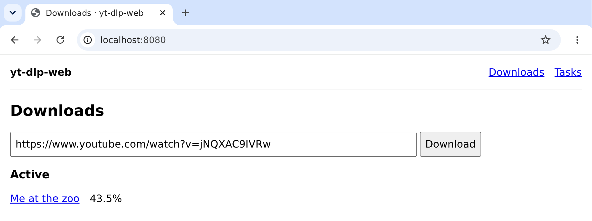

# yt-dlp-web

Web UI for yt-dlp.



## Run

```sh
docker run -p 127.0.0.1:8080:8080 -v ./downloads:/downloads ghcr.io/sjtrny/yt-dlp-web
```

Open <http://localhost:8080>.

## Documentation

- [Tasks](docs/tasks.md)
- [API](docs/api.md)
- [iOS Shortcut](shortcuts/README.md)

## Configuration

| Variable | Default | Use |
| --- | --- | --- |
| `YTDLP_DOWNLOAD_DIR` | `/downloads` | Media |
| `YTDLP_STATE_DIR` | `<download-dir>/.yt-dlp-web` | History and Tasks |
| `YTDLP_DEFAULT_TIMEZONE` | `UTC` | Default TZ for new Tasks; IANA time zone |
| `YTDLP_OVERRIDE_DIR` | Unset | Custom yt-dlp package |

### Overrides

Custom yt-dlp package:

```text
--env YTDLP_OVERRIDE_DIR=/opt/yt-dlp-override
--mount type=bind,src=/absolute/custom-package,dst=/opt/yt-dlp-override,readonly
```

Extractor plugins:

```text
--mount type=bind,src=/absolute/plugins,dst=/etc/yt-dlp/plugins,readonly
```
